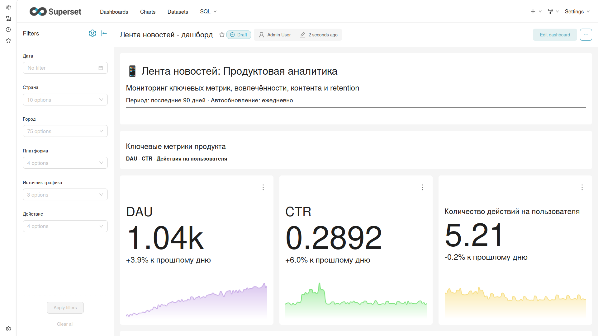
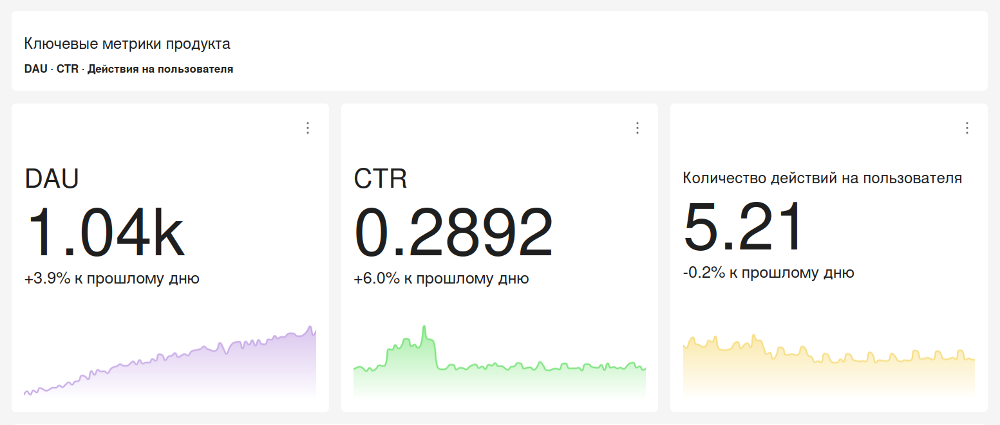
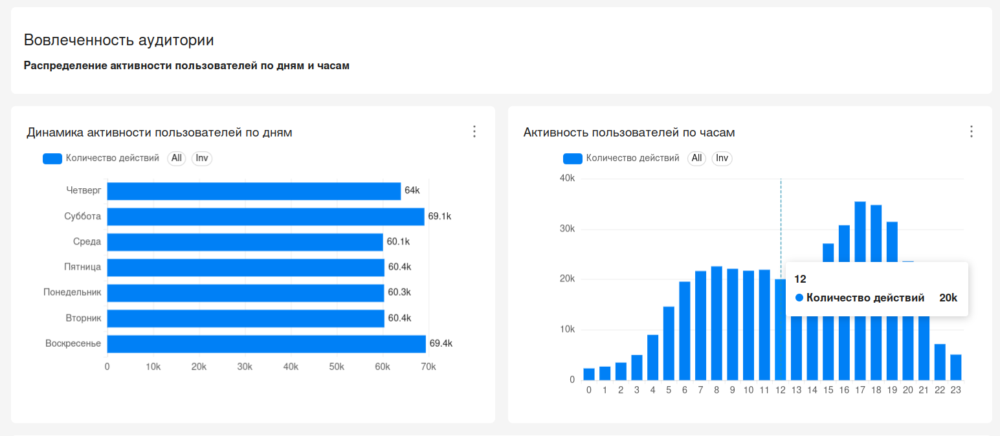
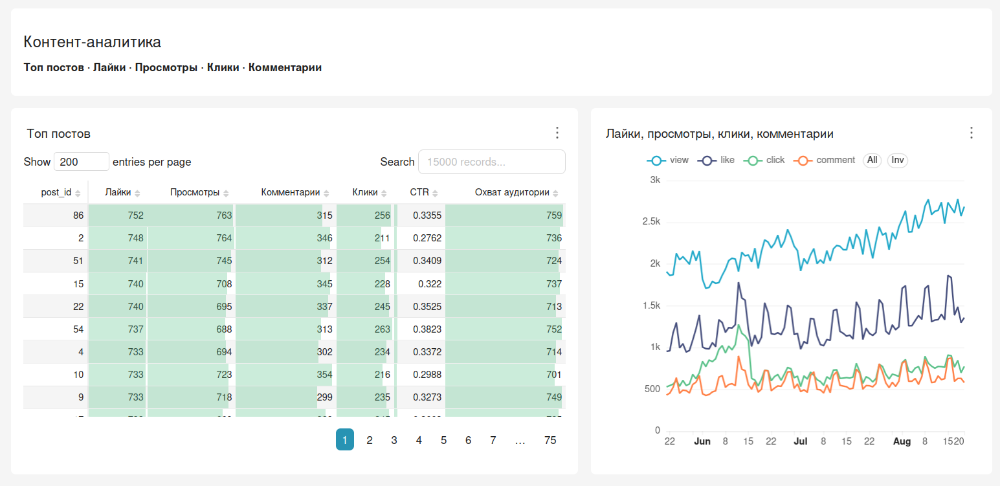
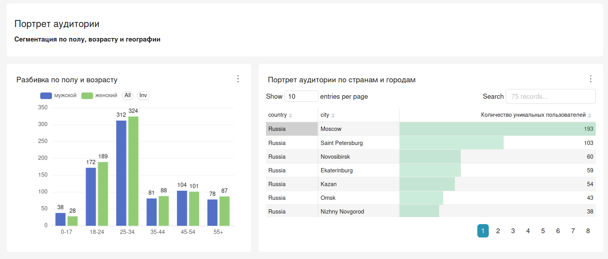
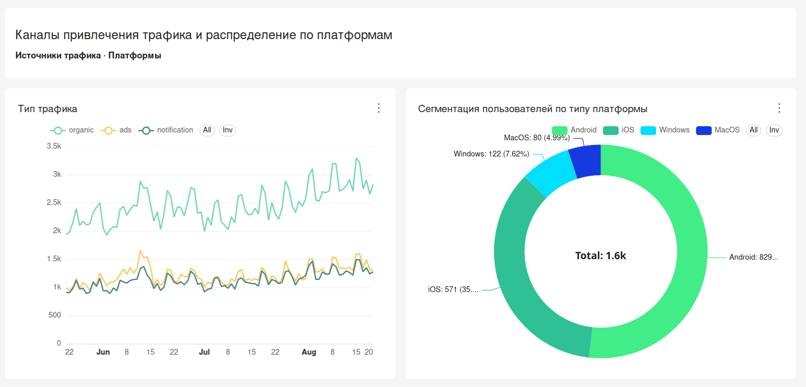
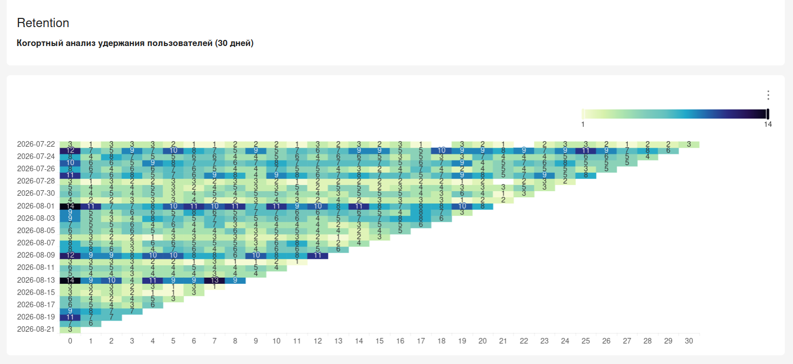

# 📊 Дашборд аналитики ленты новостей

**Инструмент:** Apache Superset 6.0
**Диалект SQL:** ClickHouse

## 📝 Описание

Исследовательский дашборд для анализа поведения пользователей в приложении ленты новостей. Дашборд помогает отслеживать ключевые метрики продукта, анализировать вовлечённость аудитории и источники трафика.

## 📈 Структура дашборда

### 1. Ключевые метрики
- **DAU** — уникальные пользователи за день (сравнение с предыдущим днём)
- **CTR** — кликабельность контента
- **Количество действий на пользователя** — средняя глубина взаимодействия

### 2. Вовлечённость аудитории
- Активность пользователей по дням
- Активность пользователей по часам

### 3. Контент
- Топ постов по лайкам, просмотрам и кликам
- Динамика лайков, просмотров, кликов и комментариев

### 4. Портрет аудитории
- Сегментация по полу и возрасту
- Распределение по странам и городам

### 5. Источники трафика и платформы
- Динамика по источникам трафика
- Распределение по платформам (iOS /Android / MacOS / Windows)

### 6. Retention
- Тепловая карта удержания пользователей по когортам

## 🔧 Фильтры

На дашборде настроены иерархические фильтры:
**Дата → Страна → Город → Платформа → Источник трафика → Действие**

## 📁 Файлы в репозитории

| Файл | Описание |
|------|----------|
| `metrics.md` | Формулы и логика расчёта метрик |
| `retention.sql` | SQL-запрос для расчёта Retention (ClickHouse) |
| `1_overview.png` | Общий вид дашборда |
| `2_metrics.png` | Ключевые метрики |
| `3_engagement.png` | Вовлечённость по дням и часам |
| `4_content.png` | Контент-анализ |
| `5_audience.png` | Портрет аудитории |
| `6_traffic.png` | Трафик и платформы |
| `7_retention.png` | Тепловая карта Retention |

## 🖼 Скриншоты

### Общий вид дашборда

### Ключевые метрики

### Вовлечённость аудитории

### Контент

### Портрет аудитории

### Трафик и платформы

### Retention

